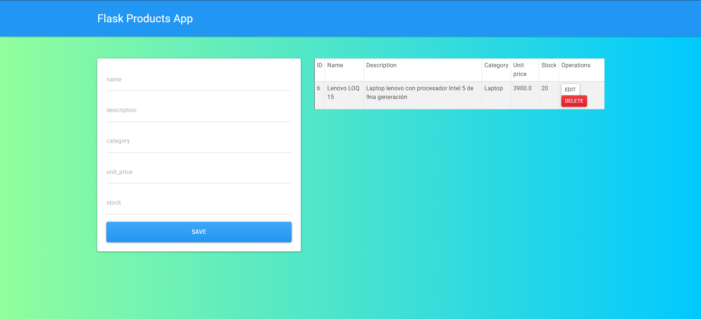

# rental-system---backend
Este es un proyecto para realizar un sistema de alquiler génerico orientado a ser una aplicación móvil
# Screenshot



### Installation

```bash
git clone https://github.com/EstebanCabreraArbizu/API_products.git
cd API_products
pip install -r requirements.txt
python app/main.py
```

### issues
- sudo apt-get install libmysqlclient-dev